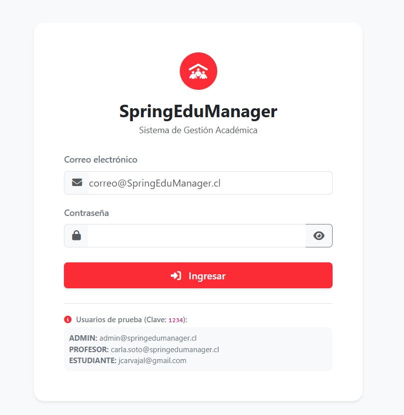
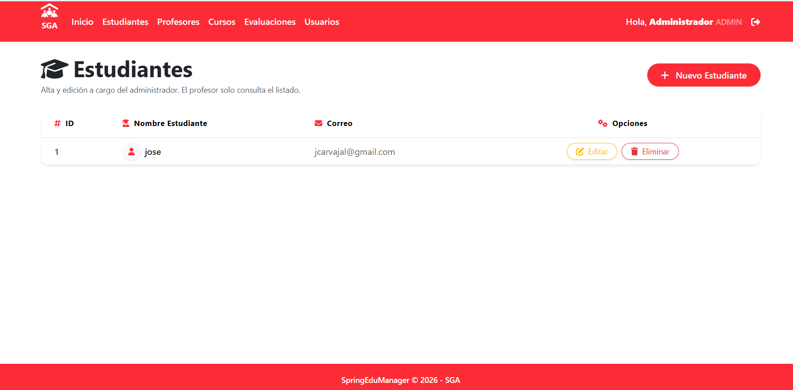
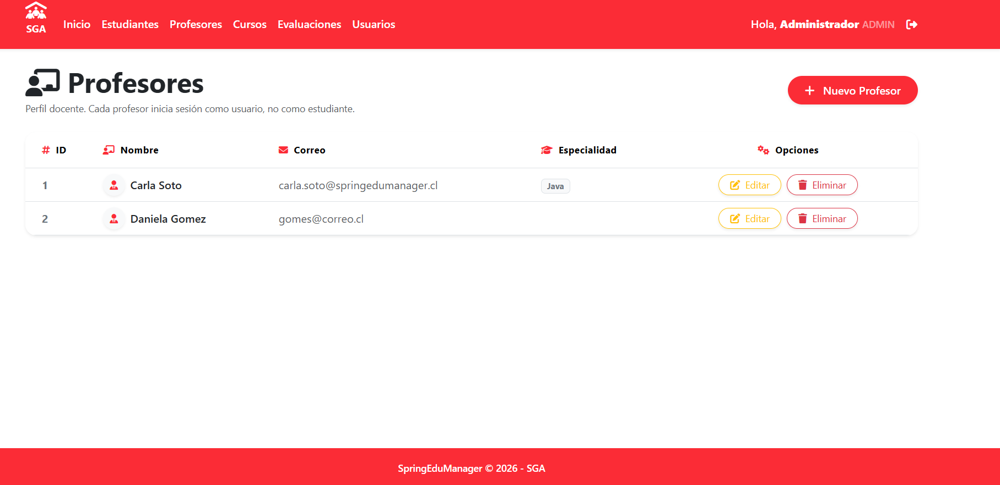
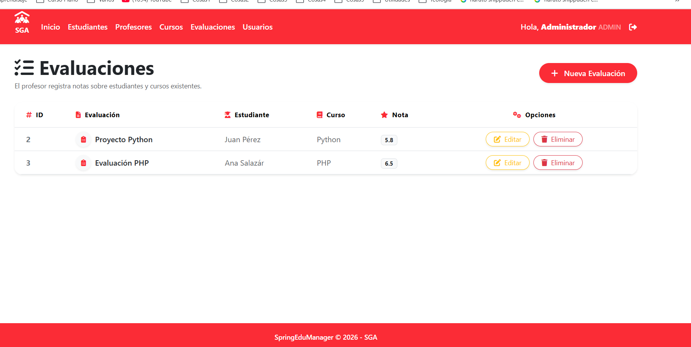
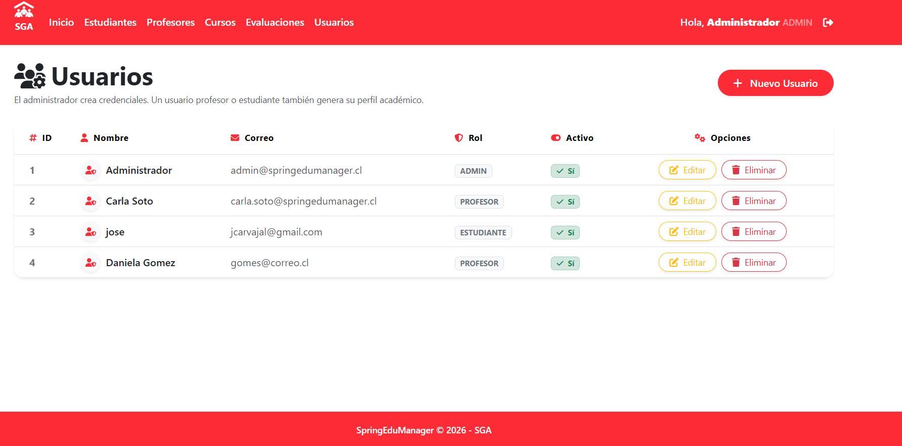

# 🎓 SpringEduManager

> Sistema Integral de Gestión Académica desarrollado con **Spring Boot**, **Spring Security**, **Thymeleaf**, **Bootstrap 5.3.3** y **Font Awesome 6.7.2**.

---

## 🚀 Descripción del Proyecto

**SpringEduManager** es una plataforma moderna y robusta diseñada para optimizar, centralizar y agilizar los procesos administrativos y académicos dentro de las instituciones educativas. El sistema cuenta con un diseño UI/UX estandarizado bajo una paleta de colores corporativa y un modelo de seguridad basado en roles diferenciados que garantizan un control de acceso seguro y eficiente.

<p>
    <strong>SpringEduManager</strong> es una plataforma integral de gestión académica diseñada para optimizar y centralizar los procesos administrativos e institucionales. El sistema cuenta con un modelo de seguridad basado en roles diferenciados con un alcance específico: el <strong>administrador</strong> gestiona de forma global la plataforma, los usuarios y los registros de la comunidad; el <strong>profesor</strong> se encarga de la organización de cursos, asignaturas y el registro detallado de evaluaciones; y los estudiantes disponen de un acceso transparente a su progreso académico. Todo ello bajo una arquitectura moderna, segura y eficiente orientada a la excelencia educativa.
</p>

---

## 🛠️ Tecnologías Utilizadas

* **Backend**: Java, Spring Boot, Spring Security, Spring Data JPA.
* **Frontend**: Thymeleaf, HTML5, Bootstrap 5.3.3, Font Awesome 6.7.2.
* **Base de Datos**: MySQL / H2.
* **Gestor de Dependencias**: Maven.

---

## 📸 Evidencias Funcionales

A continuación se presentan las capturas de pantalla de los principales módulos y vistas funcionales del sistema:

### 1. Vista de Inicio de Sesión / Login
> 
*(Adjunta aquí tu captura de pantalla de la ventana de acceso)*

### 2. Módulo de Estudiantes
> 
*(Adjunta aquí tu captura de pantalla de la gestión de estudiantes)*

### 3. Módulo de Profesores
> 
*(Adjunta aquí tu captura de pantalla de la gestión de profesores)*

### 4. Módulo de Evaluaciones y Calificaciones
> 
*(Adjunta aquí tu captura de pantalla del control de evaluaciones)*

### 5. Módulo de Gestión de Usuarios
> 
*(Adjunta aquí tu captura de pantalla del listado general de credenciales y roles)*

---

## 🔑 Credenciales de Prueba

El sistema cuenta con usuarios predeterminados (con contraseña cifrada) para validar los distintos alcances y permisos:

| Rol | Correo Electrónico | Contraseña |
| :--- | :--- | :--- |
| **ADMIN** | `admin@springedumanager.cl` | `1234` |
| **PROFESOR** | `carla.soto@springedumanager.cl` | `1234` |
| **ESTUDIANTE** | `jcarvajal@gmail.com` | `1234` |

---

## ⚙️ Instalación y Ejecución Local

Para clonar y poner en marcha el proyecto en tu entorno de desarrollo local, sigue estos pasos:

1. **Clona el repositorio:**
   ```bash
   git clone [https://github.com/tu-usuario/SpringEduManager.git](https://github.com/tu-usuario/SpringEduManager.git)
